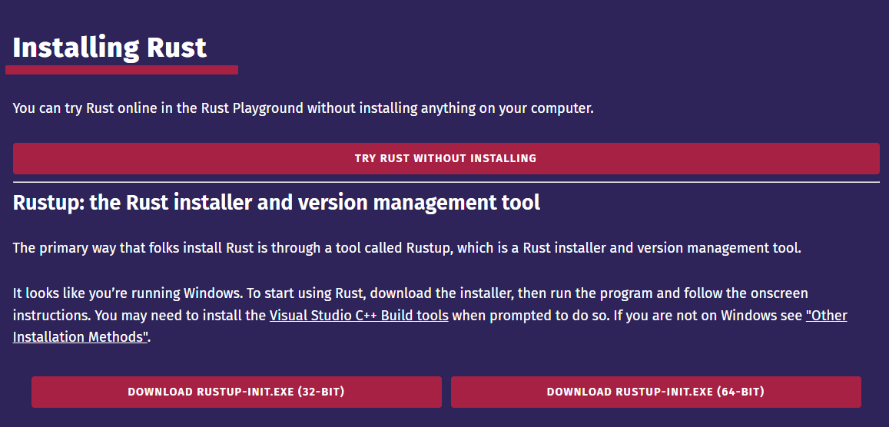

# Tree Manager

## Get Started

- Clone the repository
  `git clone https://github.com/Shitikyan/Tree-Manager-Rust.git`

## Backend

### Setup

- Open the project directory
  `cd ./Backend`

#### Setup the RUST in your PC

- Open the website of [RUST language](https://www.rust-lang.org/learn/get-started)

- Check cargo
  `cargo --version`

- Install the correct version for your computer
  

#### Install Visual Studion tools

- Install [Visual Studio Installer](https://visualstudio.microsoft.com/thank-you-downloading-visual-studio/?sku=BuildTools&rel=16) (If you don't have it on your PC)
  
  

#### Install MingW

- Install https://sourceforge.net/projects/mingw/ (If you don't have it on your PC)
  

### Get started

- Build the project
  `cargo build`

- Run the project
  `cargo run`

## Frontend

### Setup

- Open the project directory
  `cd ./Frontend`

- Install dependencies
  `npm install`

### Get started

`npm run dev`
